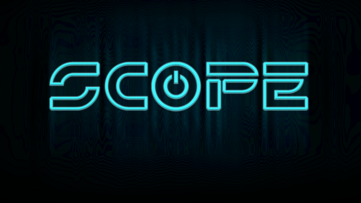

# 

Scope is designed to allow for users to keep informed of and watch upcoming competitive gaming events and tournaments. It uses [Firebase](https://www.firebase.com/) as a backend to store event information and the [Twitch API](https://github.com/justintv/Twitch-API) to gather information about live streams.

## How Scope was built ##

Scope was made using [AngularJS](https://angularjs.org/), [jQuery](https://jquery.com/) and [Sass](http://sass-lang.com/). [Grunt](http://gruntjs.com/) was used for build automation. [Mocha](https://mochajs.org/), [Chai](http://chaijs.com/) and [Karma](https://karma-runner.github.io/0.13/index.html) were used for testing.

## Installation
---

   1. Install:[git](https://git-scm.com), [node](https://nodejs.org), and [grunt](https://gruntjs.com).
   2. Clone Scope.
   3. Navigate to the root of your cloned directory and run `npm install`.
   4. Start coding.
   5. Run grunt from the root directory. The app builds from the code in the src/ folder.
   6. Have fun.

## Author

 Scope was created by [Alex Perkins](https://github.com/ac-perkins) for his final project at The Iron Yard's DC campus.
